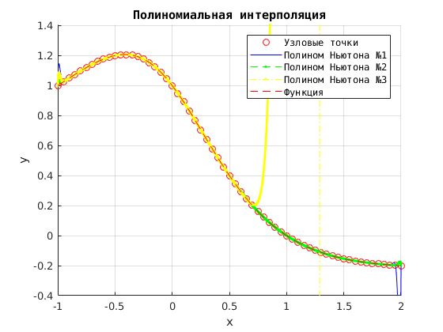

# Численные методы

## Лабораторная работа № 2
## "Численные исследования сходимости многочлена Ньютона к приближаемой функции при увеличении степени многочлена"

[Задание:](./NM/Lab01/%D0%97%D0%B0%D0%B4%D0%B0%D0%BD%D0%B8%D0%B501.txt)

1. Написать программу, исходные данные: дан отрезок [a, b] - вводим с клавиатеры,
и функция f = (1-x) / (1 + x^2), по которой будем считать значения в узлах. Используем многочлен n степени (n+1 узла),
и они равноотстощие на отрезке [a, b]. Запрограммировать вычисление многочлена Ньютона тремя известными способами в произволной точке x:
- cпособом решения системы линейных алгебраических уравнений;
- способом составления таблицы разделенных разностей;
- способом, основанным на использовании формулы через сумму обратных произведений.

2. Построить графики и сравнить с графиком функции и между собой, сделать выводы, написать отчет.

UPD: [Решение на Matlab](./NM/Lab02/matlab)
UPD: [Старое решение на Matlab](./NM/Lab02/matlab_old)
UPD: [Решение на Python](./NM/Lab02/py/Lab01.ipynb)

-------


## Трекинг и описание


### 2017-09-28 !!! УСТАРЕЛО!!! См. UPD 2017-10-06
#### UPD: добавил решение лабораторной №2 (Matlab) с выводом графиков.
[Задание:](./NM/Lab02/%D0%97%D0%B0%D0%B4%D0%B0%D0%BD%D0%B8%D0%B501.txt)
(интерполяция полиномом Ньютона)

В папке две основные функции: [interpNewton.m](./NM/Lab02/matlab/interpNewton.m) (вычисление интерполяционного полинома Ньютона в точке) и [interpolateNewtonAndPlot.m](./NM/Lab02/matlab/interpolateNewtonAndPlot.m) (вычисление полинома Ньютона для отрезка и построение графика совместно с графиком функции).
Сама исходная функция, по которой рассчитываются узлы, в файле [f.m](./NM/Lab02/matlab/f.m). 
Чтобы вызвать рассчет интерполяции и вывод графика интерполяционного полинома, необходимо в командной строке матлаба ввести и выполнить:
```matlab
interpolateNewtonAndPlot(-1, 2, 3)
```
где -1 и 2 - границы отрезка, 3 - задаваемая степень полинома Ньютона.

Функция interpolateNewtonAndPlot использует поточечный расчет значений полинома Ньютона, обращаясяь к вспомогательной функции interpNewton.

В результате работы модуля сформируется новое окно с графиком такого вида:


LINK: [Решение на Matlab](./NM/Lab02/matlab_old)

-------


### 2017-09-28
#### UPD: добавил решение лабораторной №2 на Python (Jupyter Notebook) с выводом графиков.

UPD: [Решение на Python](./NM/Lab02/py/Lab02.ipynb)

-------


### 2017-10-06 ОБНОВЛЕННОЕ
#### UPD: обновил решение лабораторной №2 (Matlab) с выводом графиков.
[Задание:](./NM/Lab02/%D0%97%D0%B0%D0%B4%D0%B0%D0%BD%D0%B8%D0%B501.txt)
(интерполяция полиномом Ньютона)

В папке несколько функциональных блоков. Расчет коэффициентов полинома Ньютона реализован в блоках:

- [coefPolyNewton1.m](./NM/Lab02/matlab/coefPolyNewton1.m) - вычисление коэффициентов cпособом решения системы линейных алгебраических уравнений;
- [coefPolyNewton2.m](./NM/Lab02/matlab/coefPolyNewton2.m) - вычисление коэффициентов cпособом составления таблицы разделенных разностей; 
- [coefPolyNewton3.m](./NM/Lab02/matlab/coefPolyNewton3.m) - вычисление коэффициентов способом, основанным на использовании формулы через сумму обратных произведений.

Чтобы вызвать рассчет коэффициентов интерполяционного полинома по одному из способов, необходимо в командной строке матлаба ввести и выполнить:
```matlab
coefPolyNewton1.m(X, Y)
```
или
```matlab
coefPolyNewton2.m(X, Y)
```
или
```matlab
coefPolyNewton3.m(X, Y)
```
где X и Y - соответсвенно матрицы координат х и у для узловых точек.

Кроме того, есть и базовая функция в файле [coefPolyNewtonBase.m](./NM/Lab02/matlab/coefPolyNewtonBase.m), в которую передается одним из параметров номер способа рассчета, а также границы отрезка и степень полинома

```matlab
[D, X] = coefPolyNewtonBase(a, b, n, number)
```
Это основная функция рассчета коэффициентов полинома Ньютона тремя разными способами, номер метода передается последним параметром (1, 2 или 3), а первые три параметра (a, b, n) - границы отрезка и степень полинома.

Функция возвращает матрицу коэффициентов D и матрицу узловых точек X, чтобы потом можно было рассчитать значение полинома Ньютона в любой точке по формуле через разности (x-x0) и т.д.

Для использования полученных на предыдущих шагах коэффициентов есть модуль [pointNewton.m](./NM/Lab02/matlab/pointNewton.m), в него нужно передавать матрицу коэффициентов D, матрицу узловых точек X и значение xx, для которого надо посчитать P(xx):

```matlab
pointNewton(D, X, xx)
```
Функция вернет значение полинома Ньютона в точке xx.

Дальше есть еще пара моделей для вывода графиков - это модуль [plotNewton.m](./NM/Lab02/matlab/plotNewton.m), который выводит одиночные графики конкретного полинома, совмещенный с графиком функции и узловыми точками, а также  модуль [plotNewtonFull.m](./NM/Lab02/matlab/plotNewtonFull.m), выводящий совмещенные графики полиномов, коэффициенты которых посчитаны всеми тремя способами (для сравнения).
Вызываются эти функции следующим образом:

```matlab
plotNewton(a, b, n, number)
```
и

```matlab
plotNewtonFull(a, b, n)
```
где a и b - границы отрезка, n - степень полинома, number - номер способа рассчета коэффициентов полинома Ньютона (см. выше coefPolyNewtonBase)


В результате работы модуля [plotNewtonFull.m](./NM/Lab02/matlab/plotNewtonFull.m) сформируется новое окно с совмещенными графиками такого вида (пример):



UPD: [Решение на Matlab](./NM/Lab02/matlab)

-------