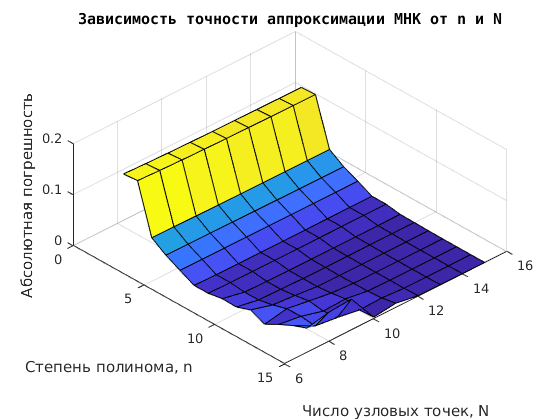
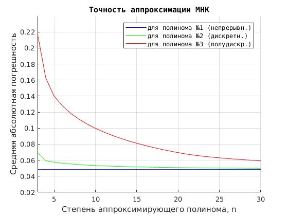
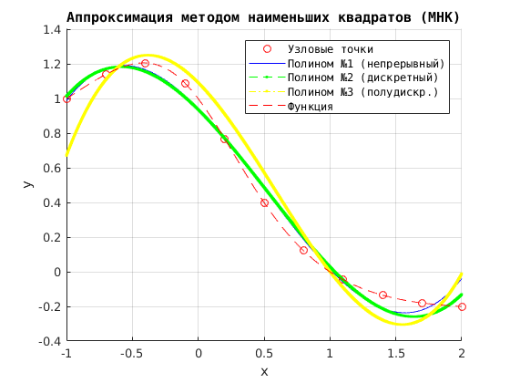

# Численные методы

## Лабораторная работа № 3
## "Численные исследования способов приближения функции методом наименьших квадратов при увеличении степени многочлена"

[Задание:](./NM/Lab03/%D0%97%D0%B0%D0%B4%D0%B0%D0%BD%D0%B8%D0%B503.txt)

1. Составить и отладить программу приближенного нахождения значения функции
с использованием полинома рассчитанного методом наименьших квадратов.
Запрограммировать вычисление аппроксимирующего многочлена в произвольной
точке x * отрезка [a, b] следующими тремя способами:
- непрерывным способом;
- дискретным способом;
- полудискретным способом (с использованием квадратурных формул
приближенного вычисления – формулы трапеций и формулы Симпсона).


2. Построить графики и сравнить с графиком функции и между собой, сделать выводы, написать отчет.

UPD: [Решение на Matlab](./NM/Lab03/matlab)
UPD: [Старое решение на Matlab](./NM/Lab03/matlab_old)

## Отчет л.р. №3 [Word](https://cloud.mail.ru/public/ACnb/DrHyXCz4Z) и [PDF](https://cloud.mail.ru/public/A9dQ/71yfhWdsH)
### Теория к лаб.раб. №3 [Гудович Н.Н. Элементы численных методов. Вып 3. МНК](https://cloud.mail.ru/public/C1jD/AddXDVL8N)
-------


## Трекинг и описание


### 2017-11-04
#### UPD: добавил решение лабораторной №3 (Matlab) с выводом графиков.
[Задание:](./NM/Lab03/%D0%97%D0%B0%D0%B4%D0%B0%D0%BD%D0%B8%D0%B503.txt)
(метод наименьших квадратов, МНК)

В папке несколько функциональных блоков. Расчет коэффициентов аппроксимирующего полинома реализован в блоках:

- [coefMNKSolid.m](./NM/Lab03/matlab/coefMNKSolid.m) - модуль, реализующий вычисление коэффициентов непрерывным способом;
- [coefMNKDiscrete.m](./NM/Lab03/matlab/coefMNKDiscrete.m) - модуль, реализующий вычисление коэффициентов дискретным способом; 
- [coefMNKQuasiDiscrete.m](./NM/Lab03/matlab/coefMNKQuasiDiscrete.m) - модуль, реализующий вычисление коэффициентов полудискретным способом.

Для вычисления значений функции F(x) для узла x использовался реализованный ранее в первых двух лабораторных работах модуль f.m.
Кроме того, поскольку в модулях непрерывного и полудискретного способов используются символьные вычисления, в отдельный модуль f_sym.m была вынесена функция, возвращающая своим результатом символьное представление исходной функции f.
Модуль coefMNKSolid получает на вход в качестве параметров концы отрезка [a, b] и степень аппроксимирующего полинома n, возвращая массив коэффициентов полинома c i . Внутри модуля задействованы символьные вычисления, которые осуществляют символьное интегрирование и дифференцирование с последующим решением системы алгебраических уравнений.
Модули coefMNKDiscrete и coefMNKQuasiDiscrete получают на вход в качестве параметров массивы координат узлов, например, следующего вида:

- X = [1; 2; 3],
- Y = [-2; 1; 6],

а также степень аппроксимирующего полинома n, возвращая массив коэффициентов полинома c i . Кроме того, дополнительным параметром coefMNKQuasiDiscrete принимает typeQuadra – номер квадратурной формулы, применяемой для приближенного вычисления интегралов в правой части
уравнений (1 – формула трапеций, 2 – формула Симпсона).

Вызов модулей осуществляется командами:

```matlab
coefMNKSolid(a, b, n)

coefMNKDiscrete(X, Y, n)

coefMNKQuasiDiscrete(X, Y, n, typeQuadra)
```

В свою очередь, чтобы однозначно определить интерфейс, обеспечивающий доступ ко всем трем модулям, реализован промежуточный объединяющий модуль
coefMNKBase.m с командой для его вызова следующего вида:


```matlab
coefMNKBase(a, b, n, N, typeMNK, typeQuadra)
```

где передаваемые параметры a, b, n – соответственно границы отрезка [a, b] и степень интерполяционного полинома, а typeMNK – номер способа, которым рассчитываются коэффициенты аппроксимирующего полинома (1 - непрерывный, 2 - дискретный, 3 - полудискретный), typeQuadra – номер квадратурной формулы, применяемой для приближенного вычисления интегралов в правой части уравнений (1 – формула трапеций, 2 – формула Симпсона). 
Часть параметров опциональна и задействуется только в определенном методе.

Модуль возвращает матрицу коэффициентов С, чтобы затем на ее основе можно было рассчитать значение аппроксимирующего полинома в любой точке.

Модуль [pointMNK.m](./NM/Lab03/matlab/pointMNK.m) получает в качестве передаваемых параметров матрицу коэффициентов C и значение x, для которого надо посчитать P(x):

```matlab
Px = pointMNK(C, x)
```

Построение графиков выполняют следующие модули:
- [plotMNK.m](./NM/Lab03/matlab/plotMNK.m) – выводит одиночный график полинома, совмещенный с графиком функции и узловыми точками;
- [plotMNKFull.m](./NM/Lab03/matlab/plotMNKFull.m) – выводит совмещенные графики полиномов, коэффициенты которых посчитаны всеми тремя способами (для сравнения);
- [plotDeltaMNK.m](./NM/Lab03/matlab/plotDeltaMNK.m) – выводит совмещенные графики зависимости средней абсолютной ошибки аппроксимации от степени аппроксимирующего полинома n (для всех трех способов для сравнения);
- [plotDelta2MNK.m](./NM/Lab03/matlab/plotDelta2MNK.m) – выводит совмещенные графики зависимости средней абсолютной ошибки аппроксимации от количества узловых точек N (для всех трех способов для сравнения);
- [plot3DeltaMNK.m](./NM/Lab03/matlab/plot3DeltaMNK.m) – выводит 3D графики зависимость точности аппроксимации МНК от n и N;
- [deltaMNK.m](./NM/Lab03/matlab/deltaMNK.m) – впомогательный модуль для расчета средней абсолютной
ошибки аппроксимации.


Вызываются эти модули следующим образом:

```matlab
plotMNK(a, b, n, N, typeMNK, typeQuadra)

plotMNKFull(a, b, n, N, typeQuadra)

plotDeltaMNK(a, b, N, n_start, n_end, typeQuadra)

plotDelta2MNK(a, b, n, N_start, N_end, typeQuadra)

plot3DeltaMNK(a, b, n_start, n_end , N_start, N_end, typeMNK, typeQuadra)

deltaMNK(Y1, Y2)
```

где a и b - границы отрезка, n - степень полинома, typeMNK – номер способа, которым рассчитываются коэффициенты аппроксимирующего полинома (1 -
непрерывный, 2 - дискретный, 3 - полудискретный), typeQuadra – номер квадратурной формулы, применяемой для приближенного вычисления интегралов
в правой части уравнений (1 – формула трапеций, 2 – формула Симпсона), n_start и n_end – начальное и конечное значение диапазона перебора степени
аппрокисмирующего полинома, N_start, N_end – начальное и конечное значение диапазона перебора числа узловых точек.

При построении графиков равноотстоящие узлы интерполяции дополняются промежуточными точками, поскольку узловых точек недостаточно для демонстрации расхождения графиков (в узловых точках они совпадают).


В результате работы модулей сформируются новые окошки с совмещенными графиками такого вида (пример):





UPD: [Решение на Matlab](./NM/Lab03/matlab)

-------


### 2017-11-04
#### UPD: добавил отчет л.р. №3 [Word](https://cloud.mail.ru/public/ACnb/DrHyXCz4Z) и [PDF](https://cloud.mail.ru/public/A9dQ/71yfhWdsH)

-------